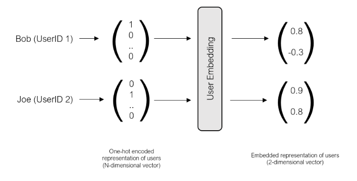
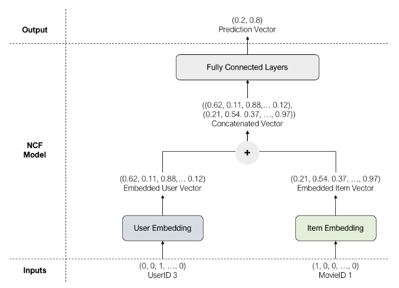
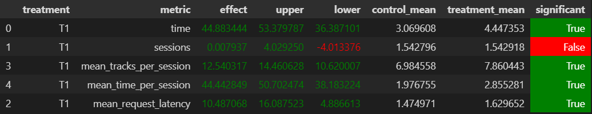

### Рекоммендер объединяет инфу о контекстно связанных треках из модели ***Contextual*** и обученной модели со связью ***user/track***. Весь процесс ее обучения можно посмотреть в [ноутбуке](Homework_notebook.ipynb). Общая информация о модели:
1. Исходный датасет - пары ***user/track***, целевая переменная ***time***.
2. Модель использует раздельные эмбеддинги для ***user*** и для ***track*** (рисунок 1), затем конкатенирует информацию, прогоняет через линейный слой и предсказывает значение времени (рисунок 2). 

3. Дальше для каждого пользователя с помощью модели из старой ***user_based*** рекомендации выделяются те треки, которые дают большее значение времени.
4. Если трека не было в `recommendations_ub.json`, то рандомятся треки из топа треков.
### Работа рекоммендера основывается на
1. Получении инфы о пользователе и о текущем треке;
2. Получением рекомендаций из контекстного и "кастомного" ***json***-файла с рекоммендациями;
3. В качестве пула для рекомендаций берется их пересечение или, в случае, если пересечение пусто, объединение. Из полученного множества рандомится одно значение следующего трека.
#### Результаты представлены ниже:
